# Reward Sweep Comparison Report

All runs: 5000 episodes, 3 seeds (0, 1, 42), real_data_size=3000.
"no sigmoid" = k=0 (normalised delta reward). ★ = best config for that dataset.

---

## 1. WGL Sigmoid k Sweep

### 1.1 Census

| Config | β-EO | EO-Δ | β-EOd | β-DP | β-F1w | β-AUC |
|--------|------|------|-------|------|-------|-------|
| no sigmoid | 0.044 ± 0.018 | -0.320 | 0.049 ± 0.010 | 0.131 ± 0.027 | 0.832 ± 0.005 | 0.885 |
| k=3 ★ | 0.031 ± 0.029 | -0.334 | 0.045 ± 0.016 | 0.137 ± 0.025 | 0.834 ± 0.004 | 0.886 |
| k=5 | 0.049 ± 0.027 | -0.316 | 0.052 ± 0.021 | 0.143 ± 0.024 | 0.833 ± 0.004 | 0.888 |
| k=10 | 0.123 ± 0.039 | -0.241 | 0.123 ± 0.039 | 0.173 ± 0.018 | 0.836 ± 0.002 | 0.891 |

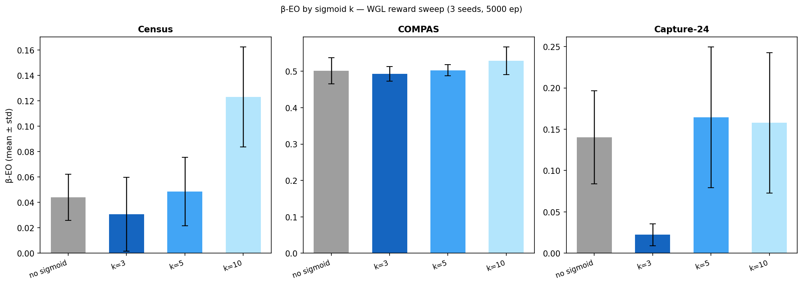

#### Per-seed detail — Census k=3

| Seed | α-EO | β-EO | EO-Δ | β-F1w |
|------|------|------|------|-------|
| 0 | 0.3421 | 0.0587 | -0.2833 | 0.8336 |
| 1 | 0.3646 | 0.0006 | -0.3640 | 0.8381 |
| 42 | 0.3856 | 0.0326 | -0.3530 | 0.8299 |

---

### 1.2 COMPAS

| Config | β-EO | EO-Δ | β-EOd | β-DP | β-F1w | β-AUC |
|--------|------|------|-------|------|-------|-------|
| no sigmoid | 0.501 ± 0.036 | -0.153 | 0.501 ± 0.036 | 0.399 ± 0.013 | 0.658 ± 0.020 | 0.704 |
| k=3 | 0.493 ± 0.020 | -0.161 | 0.493 ± 0.020 | 0.399 ± 0.010 | 0.658 ± 0.014 | 0.705 |
| k=5 | 0.503 ± 0.016 | -0.151 | 0.503 ± 0.016 | 0.406 ± 0.009 | 0.661 ± 0.014 | 0.706 |
| k=10 | 0.529 ± 0.038 | -0.125 | 0.529 ± 0.038 | 0.422 ± 0.004 | 0.656 ± 0.015 | 0.705 |

#### Per-seed detail — COMPAS k=3

| Seed | α-EO | β-EO | EO-Δ | β-F1w |
|------|------|------|------|-------|
| 0 | 0.6028 | 0.4724 | -0.1304 | 0.6679 |
| 1 | 0.6818 | 0.4936 | -0.1882 | 0.6650 |
| 42 | 0.6770 | 0.5122 | -0.1648 | 0.6424 |

---

### 1.3 Capture-24

| Config | β-EO | EO-Δ | β-EOd | β-DP | β-F1w | β-AUC |
|--------|------|------|-------|------|-------|-------|
| no sigmoid | 0.140 ± 0.056 | -0.056 | 0.140 ± 0.056 | 0.009 ± 0.005 | 0.954 ± 0.015 | 0.887 |
| k=3 ★ | 0.022 ± 0.013 | -0.174 | 0.022 ± 0.013 | 0.005 ± 0.006 | 0.952 ± 0.015 | 0.887 |
| k=5 | 0.164 ± 0.085 | -0.032 | 0.164 ± 0.085 | 0.008 ± 0.010 | 0.955 ± 0.013 | 0.888 |
| k=10 | 0.158 ± 0.085 | -0.038 | 0.158 ± 0.085 | 0.010 ± 0.011 | 0.953 ± 0.014 | 0.898 |

#### Per-seed detail — Capture-24 k=3

| Seed | α-EO | β-EO | EO-Δ | β-F1w |
|------|------|------|------|-------|
| 0 | 0.2088 | 0.0365 | -0.1723 | 0.9644 |
| 1 | 0.2061 | 0.0199 | -0.1862 | 0.9558 |
| 42 | 0.1731 | 0.0105 | -0.1625 | 0.9349 |

---

## 2. ROC-EO Lambda Sweep

### 2.1 Census

| λ (ROC-EO) | β-EO | EO-Δ | β-EOd | β-DP | β-F1w | β-AUC |
|--------|------|------|-------|------|-------|-------|
| λ=0.3 | 0.141 ± 0.125 | -0.225 | 0.141 ± 0.124 | 0.174 ± 0.047 | 0.834 ± 0.003 | 0.886 |
| λ=0.5 | 0.116 ± 0.035 | -0.248 | 0.116 ± 0.035 | 0.170 ± 0.011 | 0.834 ± 0.004 | 0.890 |
| λ=0.7 | 0.093 ± 0.030 | -0.271 | 0.093 ± 0.030 | 0.161 ± 0.009 | 0.833 ± 0.001 | 0.889 |

#### Per-seed detail — Census λ=0.7

| Seed | α-EO | β-EO | EO-Δ | β-F1w |
|------|------|------|------|-------|
| 0 | 0.3421 | 0.1030 | -0.2390 | 0.8321 |
| 1 | 0.3646 | 0.1164 | -0.2482 | 0.8341 |
| 42 | 0.3856 | 0.0594 | -0.3262 | 0.8323 |

---

### 2.2 COMPAS

| λ (ROC-EO) | β-EO | EO-Δ | β-EOd | β-DP | β-F1w | β-AUC |
|--------|------|------|-------|------|-------|-------|
| λ=0.3 | 0.470 ± 0.037 | -0.184 | 0.470 ± 0.037 | 0.383 ± 0.026 | 0.667 ± 0.023 | 0.707 |
| λ=0.5 ★ | 0.451 ± 0.051 | -0.203 | 0.451 ± 0.051 | 0.385 ± 0.040 | 0.666 ± 0.021 | 0.708 |
| λ=0.7 | 0.458 ± 0.029 | -0.196 | 0.458 ± 0.029 | 0.384 ± 0.012 | 0.668 ± 0.019 | 0.708 |

#### Per-seed detail — COMPAS λ=0.5

| Seed | α-EO | β-EO | EO-Δ | β-F1w |
|------|------|------|------|-------|
| 0 | 0.6028 | 0.4876 | -0.1152 | 0.6665 |
| 1 | 0.6818 | 0.3921 | -0.2897 | 0.6864 |
| 42 | 0.6770 | 0.4723 | -0.2047 | 0.6446 |

---

### 2.3 Capture-24

| λ (ROC-EO) | β-EO | EO-Δ | β-EOd | β-DP | β-F1w | β-AUC |
|--------|------|------|-------|------|-------|-------|
| λ=0.3 | 0.096 ± 0.026 | -0.100 | 0.096 ± 0.026 | 0.006 ± 0.003 | 0.954 ± 0.014 | 0.886 |
| λ=0.5 | 0.070 ± 0.050 | -0.126 | 0.070 ± 0.050 | 0.008 ± 0.008 | 0.955 ± 0.017 | 0.899 |
| λ=0.7 | 0.070 ± 0.088 | -0.126 | 0.070 ± 0.088 | 0.015 ± 0.013 | 0.955 ± 0.012 | 0.911 |

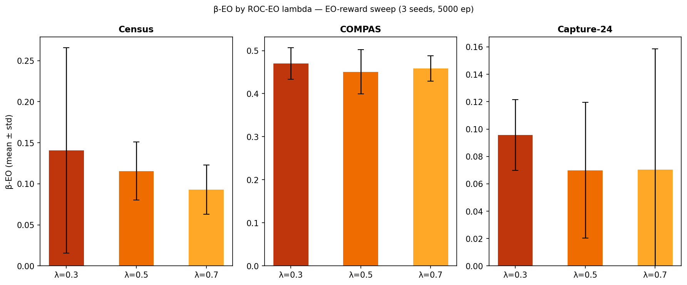

---

## 3. Best Config vs Baselines

Best config per dataset: Census → k=3, COMPAS → λ=0.5, Capture-24 → k=3. Alpha = no-intervention baseline.

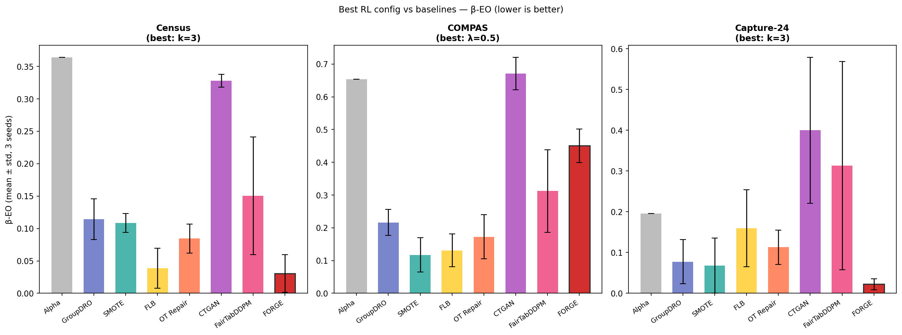

### 3.1 Census (best: k=3)

| Method | β-EO | EO-Δ | β-EOd | β-DP | β-F1w | β-AUC |
|--------|------|------|-------|------|-------|-------|
| Alpha (no intervention) | 0.364 | — | 0.364 | 0.218 | — | — |
| GroupDRO | 0.114 ± 0.031 | -0.250 | 0.141 ± 0.008 | 0.246 ± 0.014 | 0.811 | 0.888 |
| SMOTE | 0.108 ± 0.015 | -0.256 | 0.108 ± 0.015 | 0.107 ± 0.030 | 0.814 | 0.867 |
| FLB | 0.039 ± 0.031 | -0.325 | 0.091 ± 0.015 | 0.188 ± 0.018 | 0.803 | 0.874 |
| OT Repair | 0.085 ± 0.022 | -0.280 | 0.085 ± 0.022 | 0.047 ± 0.009 | 0.812 | 0.863 |
| CTGAN | 0.328 ± 0.010 | -0.036 | 0.328 ± 0.010 | 0.252 ± 0.017 | 0.827 | 0.869 |
| FairTabDDPM | 0.151 ± 0.091 | -0.214 | 0.151 ± 0.091 | 0.056 ± 0.039 | 0.819 | 0.869 |
| **FORGE (k=3)** | **0.031 ± 0.029** | **-0.334** | **0.045 ± 0.016** | **0.137 ± 0.025** | **0.834** | **0.886** |

### 3.2 COMPAS (best: λ=0.5)

| Method | β-EO | EO-Δ | β-EOd | β-DP | β-F1w | β-AUC |
|--------|------|------|-------|------|-------|-------|
| Alpha (no intervention) | 0.654 | — | 0.654 | 0.489 | — | — |
| GroupDRO | 0.216 ± 0.040 | -0.437 | 0.216 ± 0.040 | 0.184 ± 0.041 | 0.610 | 0.638 |
| SMOTE | 0.117 ± 0.052 | -0.537 | 0.241 ± 0.092 | 0.163 ± 0.078 | 0.569 | 0.640 |
| FLB | 0.131 ± 0.050 | -0.523 | 0.135 ± 0.044 | 0.059 ± 0.045 | 0.627 | 0.669 |
| OT Repair | 0.172 ± 0.067 | -0.481 | 0.172 ± 0.067 | 0.149 ± 0.036 | 0.613 | 0.701 |
| CTGAN | 0.671 ± 0.050 | +0.017 | 0.671 ± 0.050 | 0.558 ± 0.023 | 0.660 | 0.691 |
| FairTabDDPM | 0.312 ± 0.126 | -0.342 | 0.384 ± 0.035 | 0.303 ± 0.046 | 0.644 | 0.693 |
| **FORGE (λ=0.5)** | **0.451 ± 0.051** | **-0.203** | **0.451 ± 0.051** | **0.385 ± 0.040** | **0.666** | **0.708** |

### 3.3 Capture-24 (best: k=3)

| Method | β-EO | EO-Δ | β-EOd | β-DP | β-F1w | β-AUC |
|--------|------|------|-------|------|-------|-------|
| Alpha (no intervention) | 0.196 | — | 0.196 | 0.011 | — | — |
| GroupDRO | 0.078 ± 0.054 | -0.118 | 0.087 ± 0.038 | 0.042 ± 0.025 | 0.896 | 0.909 |
| SMOTE | 0.068 ± 0.067 | -0.128 | 0.070 ± 0.065 | 0.022 ± 0.022 | 0.953 | 0.891 |
| FLB | 0.160 ± 0.095 | -0.036 | 0.160 ± 0.095 | 0.062 ± 0.021 | 0.884 | 0.912 |
| OT Repair | 0.113 ± 0.042 | -0.083 | 0.113 ± 0.042 | 0.013 ± 0.003 | 0.953 | 0.913 |
| CTGAN | 0.400 ± 0.179 | +0.204 | 0.400 ± 0.179 | 0.039 ± 0.025 | 0.952 | 0.922 |
| FairTabDDPM | 0.313 ± 0.255 | +0.117 | 0.313 ± 0.255 | 0.111 ± 0.049 | 0.937 | 0.929 |
| **FORGE (k=3)** | **0.022 ± 0.013** | **-0.174** | **0.022 ± 0.013** | **0.005 ± 0.006** | **0.952** | **0.887** |

---

## 4. Learning and Generalization Curves — Best Config per Dataset

### 4.1 Census (k=3) — Learning curve

Episode return and validation EO per seed across training.

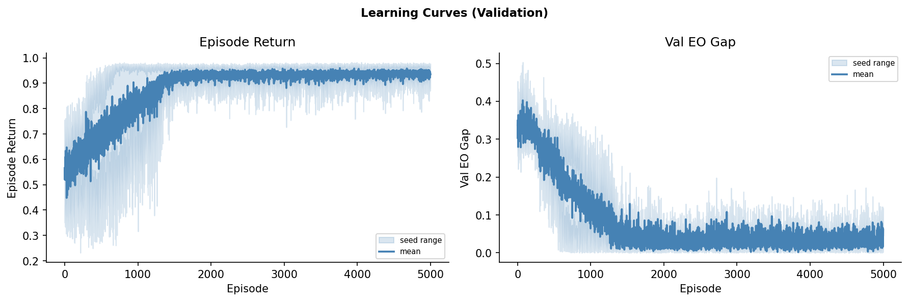

### 4.2 Census (k=3) — Generalization curve (EO gap)

Test-set EO gap at snapshot intervals (every 150 episodes).

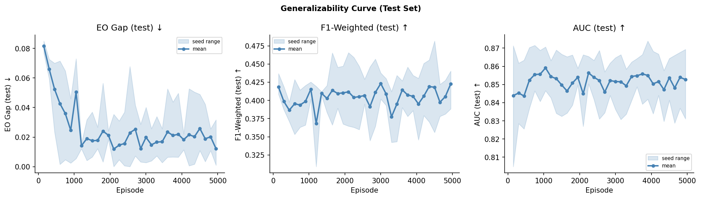

---

### 4.3 COMPAS (λ=0.5) — Learning curve

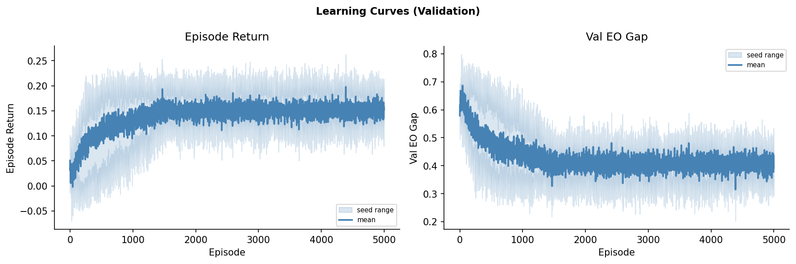

### 4.4 COMPAS (λ=0.5) — Generalization curve (EO gap)

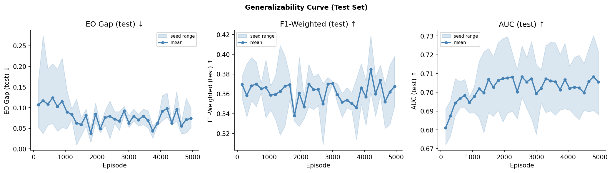

---

### 4.5 Capture-24 (k=3) — Learning curve

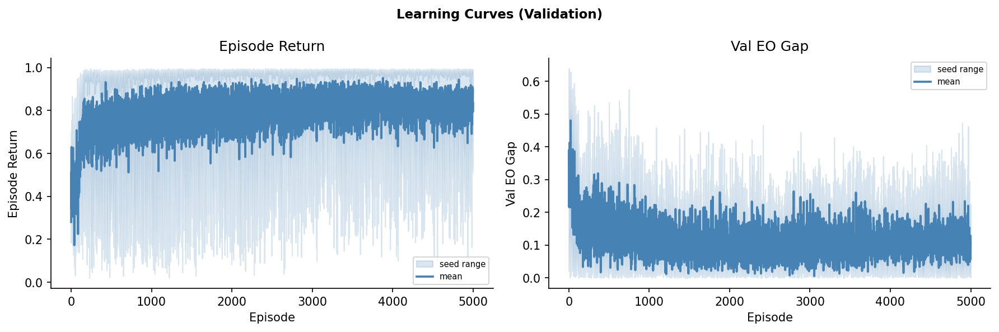

### 4.6 Capture-24 (k=3) — Generalization curve (EO gap)

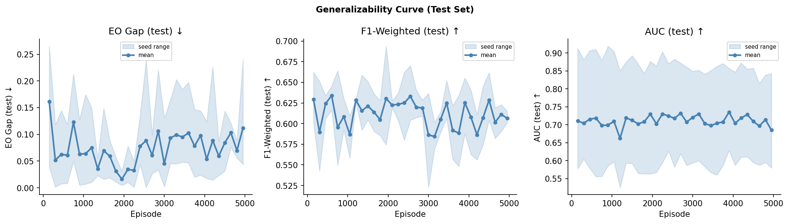

---

## 5. WGL Reward Scale Analysis

Addressing the question of whether the reward input scale (wgl_alpha − wgl_beta) differs materially across datasets and could explain the performance gap.

### 5.1 wgl_alpha is not bounded in [0, 1] on any dataset

BCE loss is unbounded; all three datasets have wgl_alpha well above 1.0. The reward input (diff mean) is the raw, unnormalized difference wgl_alpha − wgl_beta averaged across all training episodes and seeds. Sigmoid mean is the mean value of sigmoid(k × diff) across all episodes and seeds; a value near 1.0 means the agent was consistently improving the worst-group loss over alpha, while a value near 0.5 means near-zero improvement.

| Run | wgl_alpha mean | wgl_alpha range | diff mean±std | diff range | sigmoid(3×diff) mean | norm reward mean |
|-----|---------------|----------------|--------------|-----------|---------------------|----------------|
| Census (k=3) | 1.846 | [1.636, 1.954] | 0.833 ± 0.353 | [-0.387, 1.383] | 0.886 | N/A |
| Census (no sigmoid) | 1.846 | [1.636, 1.954] | 0.849 ± 0.355 | [-0.356, 1.394] | N/A | 0.454 |
| COMPAS (λ=0.5) | 2.678 | [2.566, 2.754] | 0.818 ± 0.255 | [-0.248, 1.377] | 0.900 | N/A |
| COMPAS (no sigmoid) | 2.678 | [2.566, 2.754] | 0.920 ± 0.302 | [-0.287, 1.436] | N/A | 0.345 |
| Capture-24 (k=3) | 2.494 | [2.024, 3.384] | 0.679 ± 0.558 | [-1.281, 1.852] | 0.797 | N/A |
| Capture-24 (no sigmoid) | 2.494 | [2.024, 3.384] | 0.674 ± 0.563 | [-1.501, 1.982] | N/A | 0.247 |

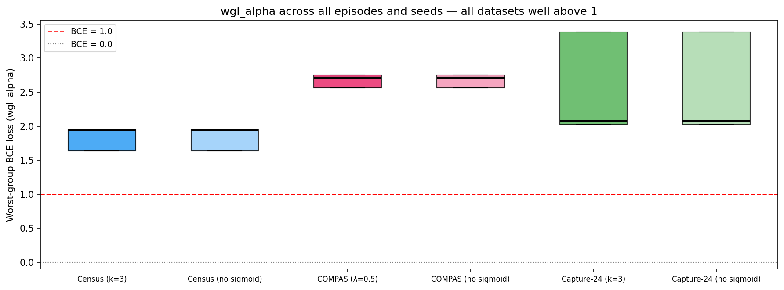

### 5.2 Distribution of reward input (wgl_alpha − wgl_beta) — pooled across all seeds

| Seed | wgl_alpha | diff mean±std | sigmoid(3×diff) mean |
|------|-----------|--------------|---------------------|
| 0 | 3.384 (constant) | 1.266 ± 0.285 | 0.965 |
| 1 | 2.024 (constant) | 0.082 ± 0.303 | 0.557 |
| 42 | 2.072 (constant) | 0.690 ± 0.247 | 0.867 |

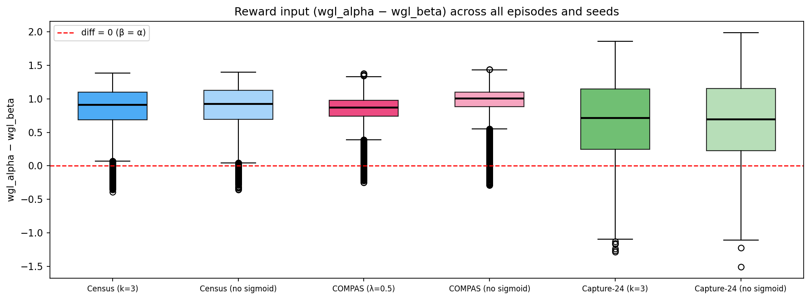

### 5.3 Sigmoid(k=3) reward value distribution — all episodes, all seeds

The sigmoid distribution shows how often the agent receives an informative reward signal. Census and COMPAS cluster tightly near 1.0, indicating the agent reliably improves wgl on most episodes. Capture-24 is bimodal: seeds 0 and 42 cluster near 1.0 (strong signal), but seed 1 clusters near 0.5 (near-zero diff, uninformative reward). This per-seed divergence in Capture-24 traces back to wgl_alpha varying 40% across seeds due to data-split instability — seed 1 produces an alpha model that is already nearly optimal on the worst group, leaving little room for beta to improve.

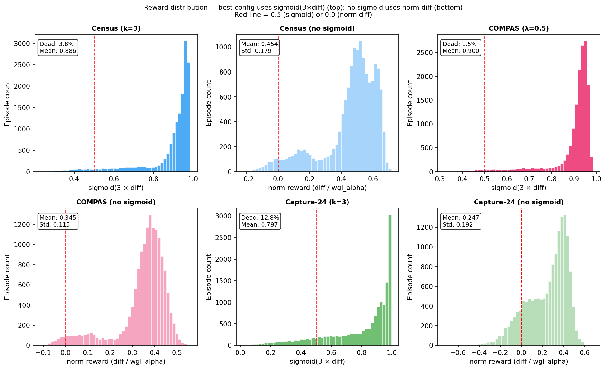
