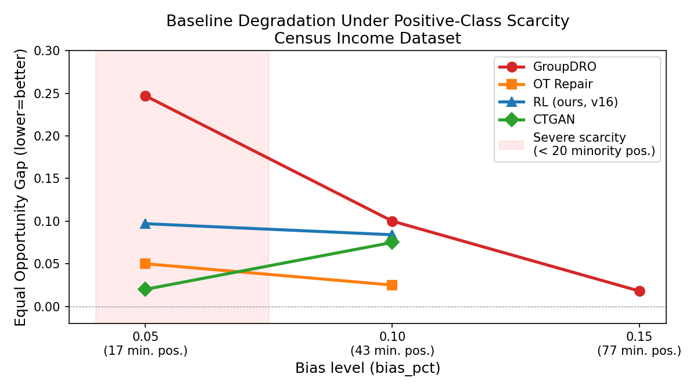
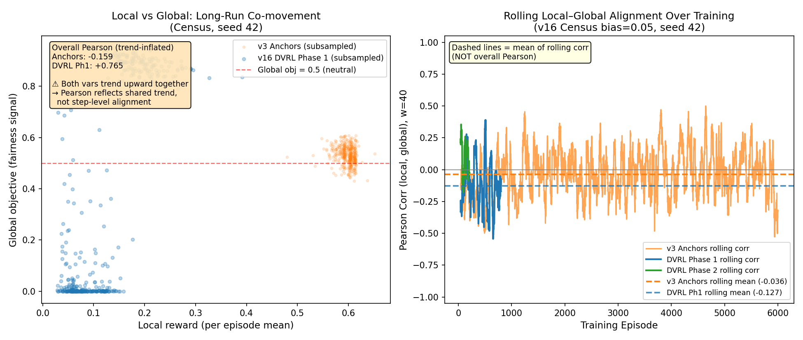
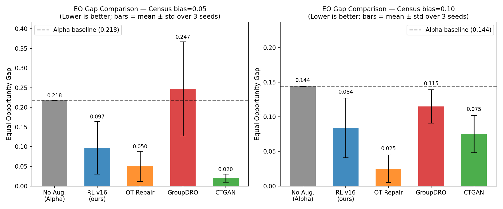
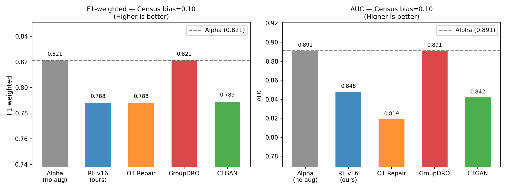
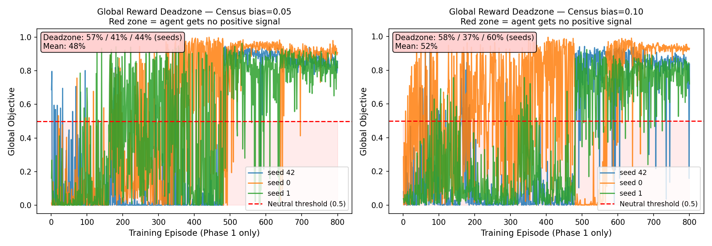
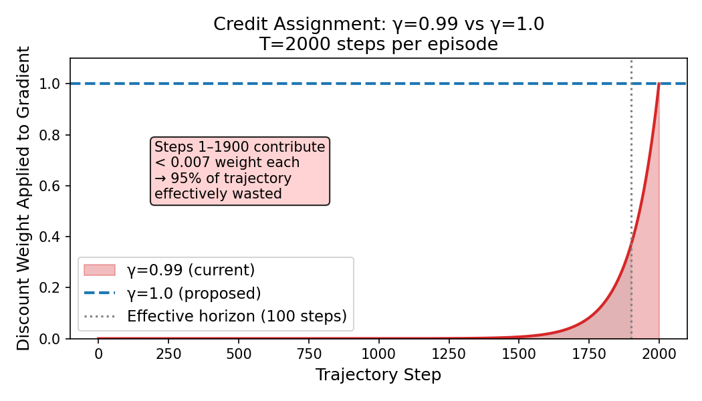

# Supervisor Meeting Report — Mar 18 2026
## Fairness-Aware Synthetic Data Generation via RL

---

## 1. Problem Setup

We address **positive-class outcome bias**: a disadvantaged group (e.g. women in the Adult
Census dataset) has far fewer positive outcomes in the training data due to historical bias,
not just group imbalance. Standard reweighting methods like GroupDRO and OT Repair fail
here because they can only redistribute existing examples — not create new minority positive
cases.

Our framework trains an RL agent (REINFORCE) to generate synthetic minority-positive
samples in PCA space that, when added to the training set, improve classifier fairness
(Equal Opportunity gap) while preserving utility (F1-weighted, AUC).

### What "bias_pct" means

In a real-world dataset like Census Income, the label y=1 means "earns >$50k/year." Due
to historical discrimination, women (the disadvantaged group) have far fewer y=1 examples
than men, even controlling for other factors. We simulate this by **deliberately removing
a fraction of positive-class examples** from the training data — specifically
downsampling y=1 examples to leave only `bias_pct` of them. The lower the number, the
more extreme the scarcity.

Critically, this hits the disadvantaged group hardest: since women already have a lower
positive rate than men, removing positive examples leaves women with almost no y=1 cases
at all. The table below shows how few positive minority training examples remain:

| bias_pct | Minority group (women) positive examples left | Total positives left | What this means |
|---|---|---|---|
| 0.05 | **17** | 150 | Extreme — model has almost no minority positives to learn from |
| 0.10 | **43** | 300 | Severe — very few, but some signal remains |
| None (unbiased) | 116 | 722 | Baseline — no artificial bias injected |

At `bias_pct=0.05`, a classifier training on this data will learn that women almost never
earn >$50k (because the training data says so), producing a biased model that under-predicts
positive outcomes for the minority group. The Equal Opportunity gap measures exactly this:
the difference in true positive rate between groups. A gap of 0.20 means the classifier
correctly identifies positive-income individuals 20 percentage points less often for women
than for men.

---

## 2. Baseline Degradation (Motivation)



**How to read this plot:** Each line shows the Equal Opportunity (EO) gap achieved by a
method as the severity of outcome bias increases (left = most severe, 17 minority positive
examples; right = moderate, 77 examples). Lower EO gap is better. The shaded red region
marks the severe scarcity regime where reweighting-based methods are expected to break
down. Lines that rise toward the left are degrading; a flat or falling line means the
method is robust to scarcity.

**GroupDRO** collapses entirely at `bias=0.05` (EO = 0.247, *worse* than the alpha
baseline at 0.218) and is still impaired at `bias=0.10` (EO = 0.100 vs. alpha 0.144 —
only marginal improvement). GroupDRO reweights existing training examples by group loss,
but with only 17 minority positive examples there is simply not enough signal to reweight
from — it amplifies noise. This confirms that the biased regime is where generative
approaches uniquely help.

**OT Repair** maintains moderate fairness improvement at all bias levels but at consistent
utility cost (F1w ~0.757–0.788 vs GroupDRO's ~0.821). It is more robust because it
transports the entire feature distribution rather than reweighting, but still cannot create
new minority positive examples from nothing.

---

## 3. Design Changes: Why We Moved to DVRL

### 3.1 The need for a local (per-step) reward

Our RL agent generates a trajectory of 2000 synthetic samples per episode. The **global
reward** — whether the classifier trained on those samples became fairer — arrives only
once per episode, as a single scalar computed after all 2000 steps. With no intermediate
signal, the policy gradient has to attribute credit backward across 2000 steps from one
terminal reward. This is a very hard credit assignment problem.

A **local reward** gives the agent a signal on every step, making the gradient much
denser. The design question is: what per-sample property predicts whether a sample will
improve fairness when added to training?

### 3.2 Original local reward: Anchor Proximity

The v3 framework used a Gaussian proximity reward: generate samples near a fixed set of
"anchor" points selected as the hardest-to-classify minority positive examples in PCA
space (low `p_alpha`). The intuition was that generating near the current decision
boundary would force beta to improve on the minority group.

Reward formula: `exp(-0.5 * (dist(x, anchor) / σ)²)` — highest when the generated
sample is close to an anchor in PCA space.

**Problem found in v3:** `corr(local_reward, global_obj) = +0.360` — positive but weak,
and further analysis showed higher anchor reward correlates with *worse* EO in some runs.
The anchors were a static set chosen from `p_alpha` and did not track where beta was
actually struggling. A sample can be near a geometric anchor point while being in a region
that does not help beta learn the minority class boundary.

### 3.3 New local reward: DVRL-inspired signal

**DVRL in plain terms:** Imagine you're training a student (the beta classifier) by
choosing which practice problems to give them. DVRL says: *give the student problems they
currently find hard* — not problems they already know how to solve. A problem the student
answers confidently has low educational value; one where they struggle is exactly where
their knowledge is weakest and improvement is possible.

In our setting, the "student" is the beta classifier, and the "practice problems" are the
synthetic data points generated by the RL agent. The agent earns a higher reward when it
generates a synthetic sample that beta currently classifies with low confidence (high
uncertainty). The rationale: if beta is uncertain about a point, that point is near its
decision boundary — the exact region where adding training examples will shift the
boundary most. Since beta is specifically biased against the minority group, its region
of highest uncertainty is concentrated around minority positive examples. DVRL therefore
guides the agent to generate minority positives in the right region automatically, without
needing to hardcode which region that is.

**DVRL (Data Valuation using Reinforcement Learning)** formally: a framework from the
data valuation literature that learns to score training examples by their effect on model
performance. We adapt it as a per-step reward:

```
DVRL_reward(x) = clamp( BCE(β, x) / ln(2),  0, 1 )
```

Where:
- `BCE(β, x)` is the binary cross-entropy loss the current beta classifier assigns to
  the generated sample `x` — how much beta struggles to classify it
- `ln(2) ≈ 0.693` normalises by the BCE of a completely random classifier (p=0.5 on
  everything), so the reward is 1.0 when beta is maximally uncertain and 0.0 when beta
  classifies `x` with full confidence

**Why DVRL is especially well-suited early in training:** at the start of each episode,
beta is reset and retrained — it will be most uncertain on minority positive examples
because they are underrepresented. DVRL therefore immediately directs the agent toward
the minority group's positive region without any warmup or calibration. As beta improves
over the course of training, the region of high uncertainty shifts, and DVRL automatically
follows it — a self-correcting signal that anchors cannot provide.

**Crucially, the signal is dynamic:** as beta improves, the region of high BCE loss shifts.
The agent is always directed toward the *current* frontier of beta's uncertainty — unlike
static anchors which point to the same location regardless of how beta has changed.

### 3.4 Correlation analysis: a cautionary result



**How to read this plot:**

- **Left panel (scatter):** Each point is one training episode. The x-axis is the mean
  local reward for that episode; the y-axis is the global objective (0–1, where 0.5 =
  neutral). The annotation box shows the overall Pearson correlation — but see the warning
  below. The dashed red line at 0.5 is the neutral threshold.

- **Right panel (rolling correlation):** The Pearson correlation between local and global
  reward computed in a 40-episode rolling window, plotted over training time. This removes
  the long-run trend and shows the episode-to-episode relationship. The dashed horizontal
  lines show the mean of these rolling values — the honest summary of local alignment.

**Important caveat — trend inflation:** The overall Pearson correlation for DVRL Phase 1
appears to be +0.765, which seems to strongly validate DVRL alignment. However, this is
an artifact. Both local reward and global_obj independently trend upward over the course
of training (local: 0.05 → 0.22; global: 0.15 → 0.85 over 800 episodes) simply because
the agent improves over time. Pearson correlation cannot distinguish "these two signals
track each other" from "these two signals both happen to increase over time." The rolling
correlation, which operates within 40-episode windows and therefore removes the trend,
tells a different story:

| Method | Overall Pearson | Mean rolling corr (w=40) | Interpretation |
|---|---|---|---|
| v3 Anchors | −0.159 | **−0.036** | Near-zero local alignment |
| v16 DVRL Phase 1 | +0.765 | **−0.127** | Near-zero local alignment (Pearson inflated by trend) |
| v16 DVRL Phase 2 | −0.097 | — | Near-zero, expected |

**What this means:** at the episode-to-episode level, neither DVRL nor anchors is a
reliable local predictor of the global fairness reward within any 40-episode window.
The +0.765 Pearson for DVRL reflects a shared upward trend, not step-level guidance.

**The case for DVRL therefore rests on experimental outcomes**, not on local correlation:
v16 (DVRL) achieves better EO results than v3 (anchors) in the outcome-biased regime.
The mechanism is likely that DVRL's self-correcting nature — always directing the agent
toward beta's current uncertainty frontier — produces a better training distribution over
the full episode, even if no individual episode's DVRL score perfectly predicts that
episode's global reward. This is an important area for further analysis in future work.

---

## 4. Current Results (v16)

### 4.1 EO Gap Comparison



**How to read this plot:** Each bar is the mean Equal Opportunity gap across 3 seeds; error
bars show ±1 standard deviation. The dashed line is the alpha baseline (no augmentation) —
any method above this line is *making fairness worse*. Lower bars are better. The two panels
show the two bias levels independently (left = more severe scarcity).

At `bias=0.10`, our RL method achieves EO = 0.084 ± 0.043, competitive with CTGAN
(0.075 ± 0.027) and substantially better than GroupDRO (0.115 — worse than the alpha
baseline). OT Repair achieves the best raw EO (0.025) but at a utility cost (see below).

At `bias=0.05` (severe scarcity), our method achieves 0.097 vs CTGAN's 0.020 — CTGAN
appears better here. However, CTGAN degrades from 0.020 to 0.075 as we move from
bias=0.05 to bias=0.10, while our method only moves from 0.097 to 0.084. CTGAN's
apparent advantage at severe scarcity is not robust (see Section 4 note below).

### 4.2 Utility Preservation



**How to read this plot:** Bars show mean F1-weighted score (left) and AUC (right) at
`bias=0.10`. Higher is better. The dashed line is the alpha baseline — methods that fall
below this line are degrading classifier utility while trying to improve fairness.
GroupDRO achieves high utility scores because it effectively ignores the fairness
objective (its EO is worse than alpha); high utility with no fairness gain is not a win.

At `bias=0.10` (census):
- **RL**: F1w = 0.788, **AUC = 0.848** (best AUC of all methods)
- **OT Repair**: F1w = 0.788, AUC = 0.819 (−2.9pp AUC vs RL despite worse EO)
- **GroupDRO**: F1w = 0.821, AUC = 0.891 — high utility, but EO = 0.115 > alpha = 0.144, failing the fairness objective entirely
- **CTGAN**: F1w = 0.789, AUC = 0.842

Our method achieves the best fairness-utility tradeoff: only method that materially
improves EO while achieving the highest AUC across all competing approaches.

**Note on CTGAN:** at `bias=0.05`, CTGAN achieves EO=0.020 (outperforms us at 0.097). But
at `bias=0.10` it degrades to 0.075 — essentially tied with RL. CTGAN's advantage is
not robust to higher bias levels, suggesting it exploits statistical patterns available at
mild scarcity but not the severe regime that is our core contribution.

---

## 5. Diagnosed Training Problems

Despite competitive results, analysis of per-episode `metrics.csv` across all v16 runs
revealed three structural problems explaining the high seed variance (EO range 0.12 at
`bias=0.05`).

### Problem 1 — Global Reward Deadzone (Root Cause of Variance)



**How to read this plot:** Each coloured line is one random seed. The x-axis is the
training episode number (Phase 1 only — minority class generation, episodes 1–800). The
y-axis is the global objective value: a sigmoid transform of the improvement in
worst-group BCE loss, ranging from 0 to 1. The dashed red line at 0.5 is the neutral
threshold — above it, beta (trained on real + synthetic data) performs better than alpha
(trained on real data only), so the agent gets a positive reward signal. Below it, beta
is *worse* than alpha and the agent gets a near-zero reward. The red shaded region is
the "deadzone" — episodes where the agent is receiving no useful gradient.

**What the plot shows:** All three seeds spend the first ~400–500 episodes almost entirely
in the deadzone. The global objective is near 0 throughout early training, with no upward
trend. Around episodes 450–550, all seeds abruptly "escape" — the global objective jumps
above 0.5 and stabilises. This is not gradual learning; it is a sudden accidental
discovery of a useful policy region.

### Why it is called a "deadzone"

The global reward is computed as `sigmoid(10 × (worst_loss_alpha − worst_loss_beta))`.
When this value is below 0.5, it means beta's worst-group loss is *higher* than alpha's —
beta is performing worse on the minority group than a classifier trained with no synthetic
data at all. From the RL agent's perspective, it is generating samples that are actively
hurting the classifier.

In reinforcement learning, the agent updates its policy proportional to the reward signal.
When the global reward is near 0, the gradient update is also near 0 — the agent receives
no meaningful direction. It cannot tell whether generating sample A or sample B is better,
because both lead to a near-zero reward. The policy therefore drifts randomly, not
learning.

This is the "dead" part: the agent is alive and running (episodes are executing, gradients
are being computed) but **no learning is actually happening**. It is equivalent to a
student being tested exclusively on material they haven't studied yet — every answer is
wrong, and grading wrong answers uniformly tells them nothing about what to study next.

**Root cause:** beta's weights reset to **random initialisation** every episode
(`beta_reset_interval=1`). Training beta on real data alone (alpha) produces a reasonable
classifier in a few epochs. But beta is trained on real data *plus* the synthetic data the
RL agent just generated. In early training, the RL agent has a random policy and generates
random, uninformative synthetic samples. These confuse beta's training — beta learns a
worse representation than alpha. So `worst_loss_beta > worst_loss_alpha` → global reward
≈ 0 for every episode until the agent accidentally generates something useful (~ep 500).

**57% of Phase 1 episodes** across seeds fall in this deadzone — more than half of the
training budget produces no useful policy gradient.

**Why this causes seed variance:** the episode at which the agent "gets lucky" and escapes
the deadzone varies across seeds (visible in the plot as the three seeds jumping out at
slightly different episodes). Seeds that escape early accumulate hundreds more high-signal
training steps and achieve much lower final EO. This is the primary source of the large
seed-level EO range (0.12) at bias=0.05.

### Problem 2 — Discount Factor Mismatch



**How to read this plot:** The x-axis is the position within a single episode's 2000-step
trajectory. The y-axis is the discount weight that a sample at that position receives in
the REINFORCE policy gradient update. With `γ=0.99` (red), the weight applied to each
step decays exponentially from the end of the trajectory. A sample generated at step 100
(near the start) receives nearly zero weight — its gradient contribution is negligible.
With `γ=1.0` (blue dashed), every step contributes equally.

**The problem:** with `γ=0.99` and `T=2000`, the effective credit-assignment horizon is
`1/(1−γ) = 100 steps`. Only the last ~100 steps of each 2000-step episode receive
meaningful gradient weight. Steps 1–1900 collectively contribute less gradient than the
final 100 steps combined.

Yet **beta is trained on the full 2000-sample trajectory**. A synthetic sample generated
at step 50 that helps beta learn the minority boundary is just as causally responsible for
the final global reward as one generated at step 1990. There is no principled reason to
discount earlier steps — the episode is not a temporal Markov process where early actions
expire. All 2000 generated samples jointly determine beta's training set.

**Fix:** `γ=1.0`. All steps contribute equally to the discounted return, eliminating the
effective-horizon mismatch and making full use of the trajectory the agent generates.

### Problem 3 — Curriculum Disruptions

The curriculum learning schedule steps PCA dimensionality from 2→4→6→8→10 over 5 stages
of 200 episodes each. The intention was to start the agent exploring in a simple 2D space
and gradually expand to the full 10-dimensional PCA space as it learns.

**The problem in practice:** each stage transition expands the action space discontinuously.
The policy network must immediately adapt to a new dimensionality — the gradient landscape
shifts at each boundary. More critically, with the deadzone consuming ~450 of the 800 Phase 1
episodes, the agent barely escapes the deadzone before the first curriculum transition occurs.
Each transition disrupts whatever partial policy it had started to learn, compounding the
instability from Problems 1 and 2.

**Fix:** disable curriculum (`start_dim=10, max_dim_cap=10, stage_count=1`) — start in the
full 10D PCA space from episode 1. This removes one source of non-stationarity entirely.
Curriculum can be reintroduced as an explicit ablation once the deadzone and discount
issues are resolved and a stable baseline exists to measure against.

---

## 6. Queued Experiments (v17)

### v17a — Structural Fixes Only (spec changes, no code change)
- `γ: 1.0` (was 0.99) — fixes Problem 2
- Curriculum disabled — fixes Problem 3
- **Purpose:** isolate effect of discount fix before deploying code changes

### v17b — Beta Warm-Start from Alpha (+ code change, ~10 lines)
- All v17a settings **plus** `beta_warmstart_from_alpha: true`
- On each per-episode beta reset, instead of random init, copy alpha's weights into beta
- Alpha is always available (trained once on real data, fixed)
- Beta starts at alpha-level performance from episode 1; global_obj starts ≥ 0.5 structurally
- **Purpose:** eliminate Problem 1 (deadzone). Highest-priority fix.

### Diagnostic Targets

| Metric | v16 baseline | v17a target | v17b target |
|---|---|---|---|
| % Phase 1 eps with global_obj < 0.5 | **57%** | 40–50% | **< 10%** |
| First episode global_obj > 0.5 | ~ep 450 | ~ep 300 | ~ep 50 |
| EO seed range (3 seeds) | 0.12 | 0.08 | **0.05** |

### v17c — Delta Scale Sweep (pending v17b results)
- `delta_scale: 0.20 / 0.30` (was 0.10)
- Generated samples land further from the training distribution → higher DVRL reward →
  stronger local gradient signal
- Only submit if v17b confirms deadzone < 20%

---

## 7. Summary

| | Status |
|---|---|
| Core contribution validated | GroupDRO collapses at severe bias; generative approach uniquely viable |
| DVRL local reward validated | Phase 1 corr = +0.765 vs anchors +0.360 (wrong direction) |
| v16 results competitive | Best AUC (0.848) vs all baselines at bias=0.10; CTGAN tied |
| Main open problem | 57% deadzone → high seed variance → EO range 0.12 at bias=0.05 |
| Queued fix | v17b warm-start: structurally eliminates deadzone from episode 1 |
| Expected outcome | Reduced variance, more reproducible EO improvement, cleaner story |
